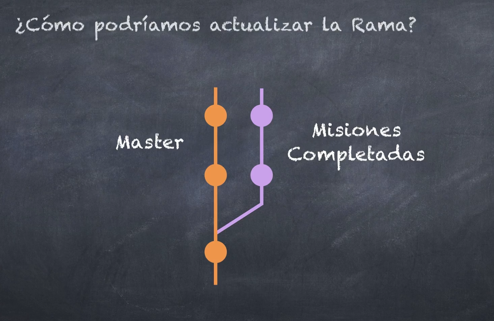
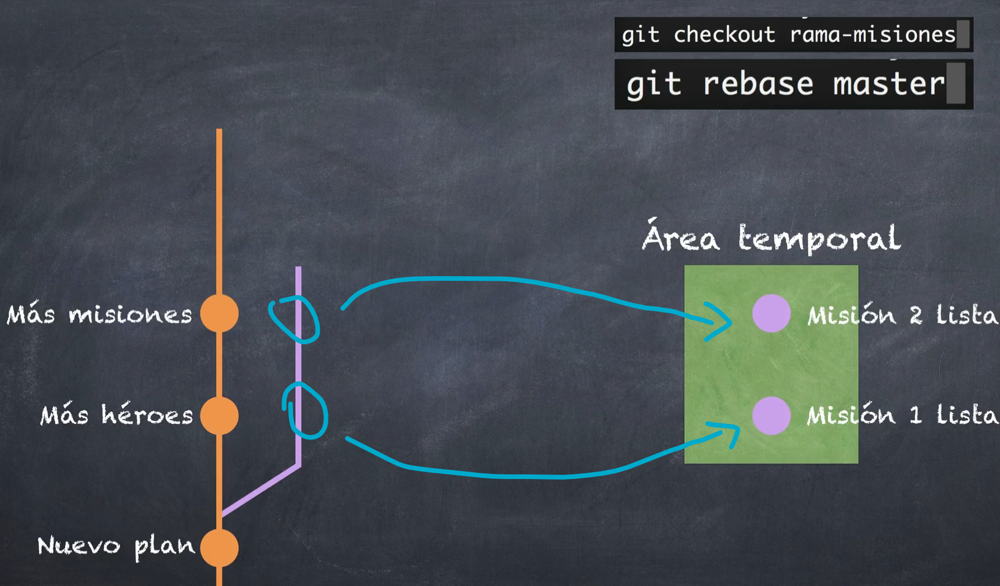
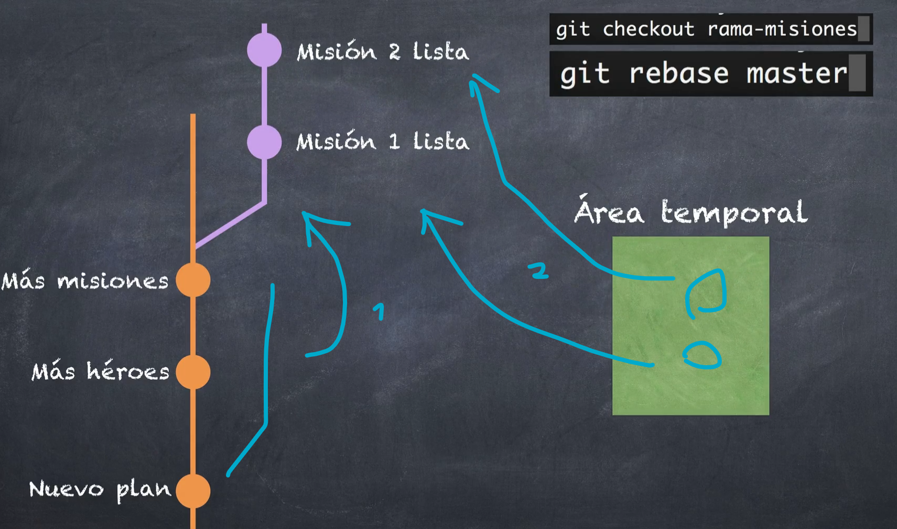
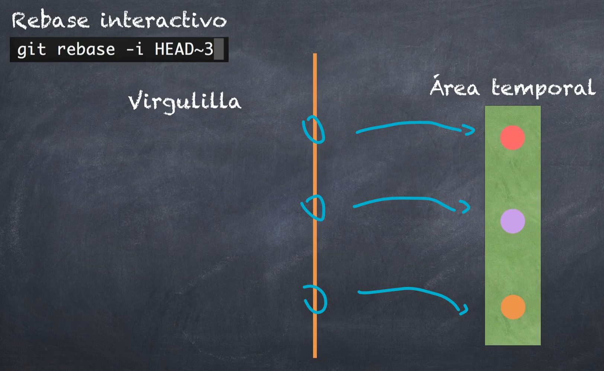
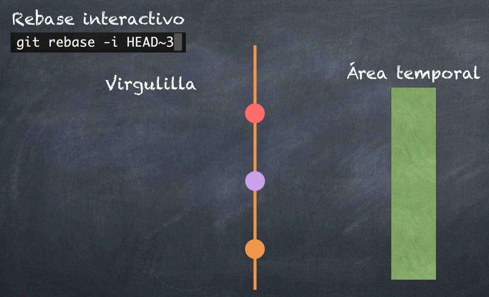

# Sección 5: Git Stash y Git Rebase - Para realizar cambios de emergencia

**recuerda tratar de no cambiar la historia (el pasado)**

## Introducción a la seccion - Stash

<!-- el stash es una boveda que contiene mis cambios en los que he estado trabajando, esta boveda es un almacen seguro que no afecta a los cambios principales.
! no se recomienda trabajar mucho con el stage, agregando varios stashes. porque puedes olvidar o saber que contenian dichos stashes.
* por lo que ni bien apagues el incendio o hagas lo que tengas que hacer, sacalo

- asi que trata de solo trabajar con 1 stash  -->

## Introducción al stash

ejemplo: cuando estas trabajando con funcionalidades nuevas pero tu jefe dice que despliegues la rama principal a produccion... entonces que sucede con esos cambios o funcionalidades que avanzaste?
ahi es donde usas el stash, que funciona como una boveda en donde colocas los cambios temporales que estabas avanzando, para recuperarlos después

## Git Stash

**haciendo un stash**... imagina que avanzas cambios en un archivo X y quieres hacer el stash

-   `git stash`: te saldra un mensaje del stash realizado que dice que se salvo el directorio de trabajo (incluye archivos de seguimiento o no) y lo indexó, también muestra el hash
-   **los cambios que realizaste se deshaceran (y no se mostraran). porque estos se pasaron al stash** también **si ves git s no veras nada**. también porque ahora estas en el ultimo commit
-   si checas git lg podrás ver que se crearon 2 commits: uno de index y otro de WIP on master (el "(refs/stash)"... donde se menciona que tienes un WIP on master (Working In Progress)). ADEMAS el commit de index se une al parecer en WIP. este es el que esta como final, donde esta el stash.
    -   **ademas verás que tu HEAD sigue estando en el commit en el que estabas originalmente (atras del commit de WIP on master)**

ver la referencia del stash:

-   `git stash list`

si haces cambios (en otro archivo) **luego de realizar el stash** (lo que te lleva a ) y haces un commit... **que pasa con el stash?** -> checa el git lg, veras una ramita separada del stash (WIP), en donde se posiciona tu HEAD principal.

-   basicamente tienes una rama principal, y una ramita con avances a un ladito

**devolviendo/recuperando el stash**

<!-- el los stash también se realizan las "uniones" y se resuelven los conflictos (segun su tipo) -->

-   `git stash pop`: aplica y borra el stash de la posicion 0 (saldra que hice el drop (botó)). **esto saca la info del stash 0 (el mas reciente), lo acopla y luego lo borra**

    -   también podras ver los cambios en el stage o unstaged que estaban pendientes
    -   basicamente ahora estas en la rama que creaste con el commit y los cambios pendientes se acoplan restauran a esta rama, mostrandose en vs code, unstaged, staged, etc.
    -   también se borra esa ramita del stash en tu git lg

<!-- todos los stash se corren hacia arriba -->
<!-- si ves git lg ya se encuentran los cambios -->

## Conflictos con el stash

<!-- esto no es comun porque podrias estar trabajando en distintas ramas -->

es similar a los merge de los commits.

-   automerging: cuando hay cambios en ambos que no se afectan, se hace un auto merge (combinacion de ambos cambios).
-   merge con conflictos: cuando hay cambios que afectan las mismas lineas de codigo... haces lo mismo para solucionar, lo abres en el merge editor y lo comparas, o lo editas manualmente, etc.

**el punto es que debes resolverlo y luego ya haces tu commit para guardarlo.**

_puede que quede algo en el stash... como lo borras? o ignoras cambios? checa la siguiente seccion..._

## Stash avanzado

<!-- ! recuerda que si haces un buen trabajo con tus ramas, creandolas y asi... entonces deberias evitar usar o hacer varios stash -->
<!-- ! ni bien terminas con los stash deberias borrarlos inmediatamente -->

**borrando TODOS los stash, sin preguntar**

-   `git stash clear`:
<!-- * en teoria no borra todo en realidad porque siempre tienes la referencia con su propio hash en el git reflog el cual puedes recuperar -->

<!-- ! si la consola no acepta el "@" o lo interpreta mal... trata de poner todo ese codiguito que lo involucra... entre comillas "" -->

si editas la misma linea de codigo y en cada edicion haces un stash... estos se almacenandesde el 0 (el más reciente) por ejemplo hasta el 2...
y que pasaría si quieres recuperar uno de estos stash?

-   `git stash apply stash@{2}`: restaura el stash 2... pero NO LO BORRA

<!-- ! recuerda que para irte a un stash y quedarte ahi o hacer que se borre este (al que te moviste) de la lista de stash... debes hacer `git stash dpop "stash@{2}"` -->

moverme de un stash a otro:

-   si estas en un stash y quieres pasar a otro debeeras hacer un nuevo stash y luego borrar ese para recien poder pasar a otro stash... porque si usas apply estan en un stash para moverte a otro no funcionara porque git mencionará "sobreescritura"...
-   lo mismo dice chatgpt "Para moverse de un stash a otro en Git sin borrar ninguno de ellos, debes aplicar un stash, guardar tus cambios actuales en un nuevo stash si es necesario, y luego aplicar otro stash."

borrando un stash especifico:

-   `git stash drop "stash@{0}"`: borra el stash 0
<!-- * el stash@{0} sería lo mismo que no ponerlo y solo dejar git stash drop -->

revisando un stash en particular:

-   `git stash show "stash@{1} -p"`: muestra más informacion sobre las lineas modificadas
    <!-- si quieres ver los camvios de todos: `git stash list -p` o `git stash list --stat  -p` -->
    <!-- -   `git stash show "stash@{1}"`: muestra poca informacion de igual manera -->

**creando un stash pero colocandole un nombre**

-   `git stash push -m <message>`: esto es mas moderno que el anterior supuestamente deprecado

<!-- -   `git stash save "Agregamos tal y cual` -->

mas info sobre los stash: https://git-scm.com/docs/git-stash

## Introducción al git rebase

casito: si yo cree una rama y ahi estoy trabajando... y al mismo tiempo mi compañero edita en la rama principal... **que hago si quiero acoplar los cambios/commits de la rama principal (u otra rama) a mi rama?... como podriamos actualizar mi rama (misiones completadas)?**

**rebase normal:**
te mueves a tu rama misiones con "checkout", y haces el `git rebase master`.

-   ese ultimo comando crea un area temporal en donde mueve los commits de la rama misiones... 
-   y luego mueve el puntero de esta rama hacia el ultimo commit de la rama master... y luego regresa los commits del area temporal, hacia la rama misiones que ha sido movida 

**rebase interactivo:**
apunto a head y a 3 commits antes (También puede ir un hash)

-   esto crea un area temporal hacia donde los commits se mueven ...
-   y luego los devuelve 
-   para que nos sirve esto?: ordenar commits, corregir mensajes de los commits, unir commits (cuando hicimos varias modificaciones en un archivo los cuales deberian estar en un commit) y separar commits (cuando tenemos demasiado cargado un commit y debemos separarlo)

<!-- los cambios a hacer con el rebase solo haganlo si no lo has subido. porque puede que no seamos los unicos que trabajamos con nuestro proyecto -->

## Rebase - Actualizando una rama

<!-- tenemos 2 ramas, la principal con 2 commits y la otra con 2 commits...
la manera mas sencilla es con un rebase, aunque también puedes hacerlo con un merge estando parado en la otra rama -->

te mueves a tu rama misiones (la otra) con "checkout", y haces:

-   `git rebase master`: la otra rama tendra todos los cambios de la rama master. en el git lg verás que la otra rama esta por delante de la principal, lo cual creo que significa que esta rama se actualizo... pero que sigue siendo una rama separada. prueba haciendo commits en la rama principal y veras que se bifurcan ambas ramas.
    <!-- \* posiblemente te salga file name too long... lo podrias arreglar con esto: git config --system core.longpaths true... abriendo vscode como administrador
    -->
    <!-- recuerda que git tratara de "unir" digamos las ramas, por lo que se aplicarán los tipos de uniones y la resolucion de conflicto -->

ahora ya puedes un merge, parandote en tu principal y luego `git merge rama-misiones completadas`..dara fast-forward porque esa rama tenia los ultimos cambios de la rama master... y como ya hicimos el merge entonces ya puedes borrar la rama secundaria

<!-- usualmente el profe se va mas a hacer un merge de rama master a la otra. PERO EL REBASE NORMAL AYUDA MUCHO A ACTUALIZAR EL PUNTO INICIAL DE MI RAMA... no es algo que usa el profe (el rebase normal) -->

## Rebase - Squash (unificando ramas)

entrando en el rebase interactivo:

-   `git rebase -i HEAD~4`: entras en el modo edicion con los comandos de ayuda...
    <!-- -i: interactivo
    HEAD~4: especifica cuandos commits atras quieres, en este caso 4 -->
    <!-- ! el rebase, especialmente correcciones de nombres o serparaciones... trata de hacerlo si y solo si las modificiaciones no han salido de mi compu porque sino caeras en conflicto  que alguien mas tendra que resolver (pej cuando haces un pull o algo asi)

*   recuerda procurar no hacer modificaciones a la historia, por los conflictos -->

unificando las 2 ultimas ramas:

<!-- -   presiona tecla "A" -->

-   dentro del modo edicion...
<!-- pick significa elegido, solo significa que se eleigio para ser parte del rebase interactivo pero realmente no hace nada -->
-   **solo al costado de la ULTIMA RAMA, reemplaza "pick" por `s`**: esto indica que uniras las 2 ultimas ramas
<!-- no pongas una "s" al costado del penultimo porque sino uniras las 3 ultimas ramas -->
-   para salir: wq! o cerrar vs code -> aparece una nueva ventana para colocarle el nombre de alguna de los 2 commits para el unificado. **por defecto se coloca el del penultimo**
-   el rebase termina

## Rebase - Reword (renombrar)

<!-- recuerda que si son commits muy viejos o que ya hiciste un push mejor dejalo en su lugar -->

(entra al rebase -i) haces los mismos pasos anteriores pero sin el `s`

<!-- podrias pensar que puedes modificar directamente los mensajes pero no lo hagas asi -->

-   en vez de reemplazar una `s` por el "pick", **reemplaza una `r`... en todos aquellos a los que les quieres cambiar el nombre**... cierra o wq!
-   aparecera otra ventana... A para entrar a edicion o edita directamente el nombre... cierra o wq!...
-   lo mismo de la anterior linea para el reword restante
<!-- ! puede que en alguno te aparezcan 2 mensajes de commits... eso puede ser por ammend o merge anterior, etc... solo modifica el ultimo, el cual vendria a ser el actual  -->

## Rebase - edit (separando commits)

<!-- ! nuevamente recuerda que si los cambios pertenecen a un repositorio y este los clono alguien mas... alguien tendra que hacer la correccion de esos conflictos -->

si haces 3 modificaciones en 3 archivos independientes... estos se van al unstaged con Modified... que hay si quieres regresar los cambios de solo 1...

-   `git checkout -- README.md`: los cambios realizados se restaurarán

**ahora** suponiendo que agregaste **todos** al staged e hiciste un commit...

y ahora como haces para que esos 2 archivos que modificaste se creen como 2 commits independientes

-   `git rebase -i HEAD~3` -> reemplazas "pick" por `edit` o `e` **EN EL ULTIMO COMMIT** -> salir
-   **entraras en el modo de rebase manual** para que puedas realizar los cambios que creas necesarios
    <!-- si checas git status te mostrara que estas en medio de un rebase interactivo -->
    <!-- todos tus archivos del explorador estaran igualitos a como los dejaste antes de hacer los comandos -->

-   `git reset HEAD^`: haciendo un reset del commit anterior (los cambios se pasan al area de trabajo y unstaged). nos vamos al commit anterior, muestra el unstaged. estamos en el punto exacto antes de que decidieramos subirlos al staged y hacer el commit

-   **añades un solo archivo (de los 2) al staged**, y haces un commit
-   **añades el archivo que queda al staged**, y haces un commit

-   checa el git lg, y veras una bifurcacion curiosa del commit, por un lado master y por otro tu head (junto a los commits que estas creando en el modo rebase)

-   git rebase --continue: termina el rebase.
-   checa el git lg -> **veras que el commit se dividió exitosamente**

<!-- si tienes un error detached heade... solo te mueves a la rama master -->
