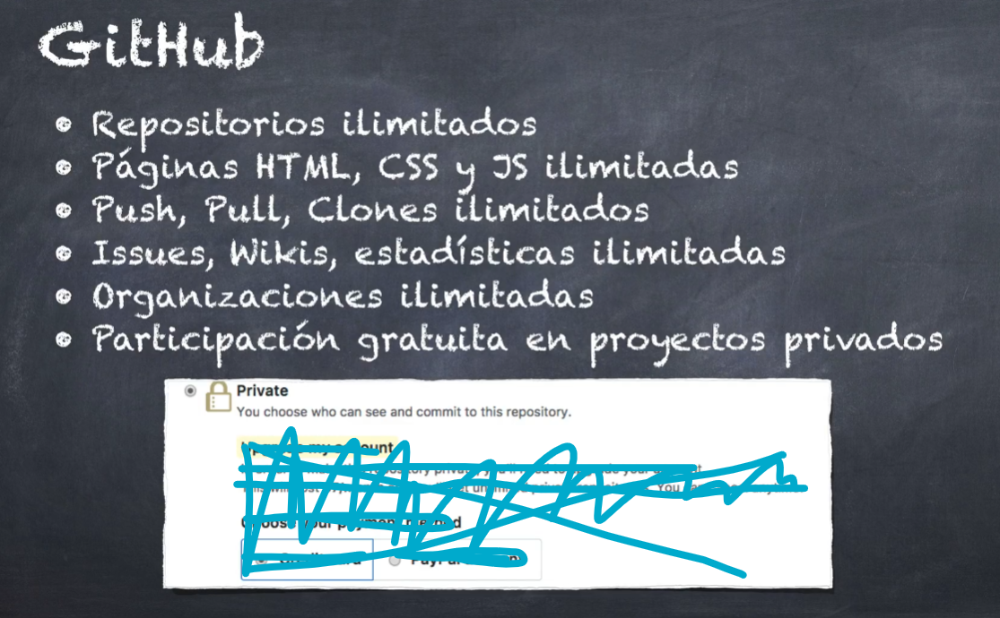

# Sección 6 GitHub, Git Remote, Push & Pull

## Introducción GitHub Remote - Push & Pull

push: empujar al repositorio remoto
pull: obtener del repositorio remoto


git no maneja el acceso al repositorio (o sea permisos a archivos especificos, etc)... para eso usas otros servicios


github es una plataforma de desarrollo colaborativo de software para alojar proyectos


por que github es tan popular?


**cuando vamos a crear un repo**...  y 

1. cuando estamos en nuestro repo local y queremos añadir un repositorio remoto :

-   `git remote add origin https://github.com/...`
    -   `add`: agregar un nuevo remote
    -   `origin`: nombre que le damos a nustro repositorio (que se llame origin es un standar para referirnos al origen)
    -   `https://github.com/...`: dirección donde estará el repositorio

<!-- si queremos revisar las fuentes remotas que tenemos agregadas al repositorio ejecutamos :
por ejemplo para revisar cual es el path en donde se encuentra nustro repositorio... el fetch es dde donde obtenemos la info y el push es donde hacemos la subida de la info. puede ser diferente pero generalmente son iguales
-   `git remove -v` -->

2. cambiando nombre de la rama:

-   `git branch -M main`: cambiar el nombre de la rama master a main

3. haciendo el push

-   `git push -u origin main`
    -   `origin`: nombre del repo que nosotros queremos.. cuando vayamos a hacer la subida de la info
    -   `main`: rama que deseamos enviar al repositorio
    -   `-u`: (establecemos como nuestro repositorio remoto por defecto) nos ayuda aque la prox vez que queramos hacer un push (con solo `git push`) no tengamos que especificar la rama... porque ya establecimos la rama main por defecto

nos pedira usuario y contraseña de github, despues se hara un push 

<!-- hay una config para que en cada push ya no nos pida las credenciales -->

## Documentaciones utiles

**Guía oficial de Gitosis**
Esto no lo cubro en el curso, pero lo dejaré aquí por si tienen curiosidad.

-   ¿Qué es Gitosis? https://wiki.archlinux.org/title/gitosis#:~:text=Gitosis%20is%20a%20tool%20which,system%20accounts%20on%20the%20server.
-   Instalación y configuración https://github.com/res0nat0r/gitosis

**Guardar su contraseña de GitHub en la máquina WINDOWS**

-   Guardar usuario y contraseña de GitHub https://github.com/res0nat0r/gitosis

Guardar su usuario y contraseña en la máquina LINUX

-   Guardar usuario y contraseña de GitHub en la máquina https://docs.github.com/en/get-started/getting-started-with-git/caching-your-github-credentials-in-git#platform-linux

Para usuario de OSx 10.0 o superior, el KeyChain se los maneja automáticamente.

## Push a GitHub

Colocale un nombre fijo o definitivo al respositorio que creas, este si puede cambiar pero no es recomendable ya que se tendrian que actualizar todas las referencias que aputan hacia nuestro repo

publico: cualquier persona lo podra ver, clona y hacer pull request... no podran hacer commits, a menos que lo habilites

a dia de hoy ya es un poco indiferente usat https o ssh... pero el profe suele usar https

**haciendo el push**

como ya tienes tus git en tu repositorio, además de los archivos readme, etc... no es necesario añadirlo. por lo que solo pega en tu terminal lo demás:

```
git remote add origin https://github.com/...
git branch -M main
git push -u origin master
```

**y listo, tu repo ya esta en la nube**
gracias al ultimo comando... con solo hacer `git push` se sube toda mi rama principal a

desde github puedes ver los commits, así como los archivos modificados y las lineas modificadas, en version unificada o dividida (split)

-   también puedes agregar comentarios en lineas de codigo, reacciones ,etc.

**cuando despliegas git lg podrás ver una nueva opcion al costado de tu rama, esta es "origin/main"**

-   _HEAD_: donde estas parado actualmente
-   _main_: repositorio local en la rama main
-   _origin/main_: repositorio remoto... no necesariamente lo tendremos como origin, pero este es por defecto o estandar. este origin hace referencia al repositorio de github que tenemos en este momento. también podemos tener diferentes origenes, por ejemplo si tenemos 2, el 2do se llamaría upstream.

## Push de los tags de nuestro repositorio

los tags no se suben automaticamente a nuestro repo, nosotros tenemos que hacerlo manualmente.

**subiendo a github todos los tags al mismo tiempo**

-   `git push --tags`: ya podras ver los tags

## Creando - Relase tags

**creando releases**

-   puedes crear releases en github a partir de los tags. solo entra a un tag y le das al boton de `create release`: añades un titulo, descripcion del release... también puedes subir fotos, en el apartado del markdown o en el de binaries
-   lo bueno de esto es que también nos crea una url especifica que nos dirige a ese release
<!-- set pre-release: lo marcas si todavia es una version que esta en desarrollo, como por ejemplo si es un alfa o un beta -->
-   y listo, ahora en el apartado de realases aparecéra... también en tu pagina principal de este repo aparecerá "Releases"

-   al crear mas releases te darán la opcion de `marcar release como the lastest`

## Pull de los últimos cambios en el repositorio de GitHub

si vas a tu repo en github puedes editar cualquier archivo directamente desde ahi (lo cual no es recomendable) con lo que te dirá que crees un commit en la rama principal o que crees una nueva rama...  
si lo haces y vas a tu carpeta en vs code... no aparecen dichos cambios

**como me traigo los cambios de github (del origen que esta seteado por defecto) a mi repositorio local?**

-   `git pull`: te mostrara un mensaje de union, en este caso fast-forward
    <!-- también puedes hacer `git pull origin main` -->
    <!-- recuerda que siempre puedes ver el path donde se encuentra tu repositorio con el codigo `git remote -v` -->
    <!-- * puede que aparezca una info de color o warning... con eso se trata de evitar de que git asuma como quiere que funcione la parte de merge, fast forward o rebase... **basicamente nos pide que lo configuremos** -->

## Warning - Pulling Without reconcile strategy

<!-- ! en mi caso no lo aplicaré porque por defecto ya se aplica el fast forward -->

**por si te aparecia un warning en lo anterior**, este dice que tienes que especificar como quieres que se reconcilie o que tecnica o estrategia se va a aplicar a la hora de unir nuestro repositorio remoto o local...

**usualmente lo que se busca es hacer un fast-forward. por lo que ahora lo configuramos** para establecer ello y que no aparezca el warning:

-   `git config --global pull.ff only`: cuando hagamos pull se aplicara el fast-forward
    <!-- en `git config --global -e` podras ver [pull] ff only -->
    <!-- en mi caso al hacer esto ultimo, como no configure nada, no aparece eso... pero ya esta digamos aplicado por defecto por git  -->

## Clonar un repositorio

si clonas el repositorio, lo clonado tendr+a el historial de commits etc.. mientras que si descargas como zip de github solo estaras descargando el proyecto tal y como se encuentra en dicha version

supongamos que borraste tu carpeta 09-heroes accidentalmente... pero antes la subiste a github por lo que ya tienes tu proyecto en la nube aun asi lo borres... entonces como clonas ese repositorio de la nube que creaste, si borraste tu carpeta en local

**clonar un repo**

-   ve al repo en github, copia el link https (del boton que dice <> code)
-   en la terminal: muevete a la carpeta donde quieres que se copie o clone el proyecto
-   digita `git clone https://github.com/...`
-   te clonará el repositorio pero el nombre de la carpeta será aquel que le colocaste en el repo de github... **pero tranquilamente puedes renombrarlo**

## Subir cambios locales al remoto

para git es indiferente si subiras a github, bitbucket u otro. el proceso es el mismo

**si hiciste cambios locales (commits) y quieres subirlos a github...**

-   `git push`
<!-- no tienes que especificar el -u origin main porque en tu primera subida ya lo estableciste por defecto -->

**si haces cambios en tu archivo local y a la ves en github... en la misma linea y en ambos haces commit (causas conflictos)... y haces `git pull` (para traer los cambios)...**

1. si lo configuraste para que siempre haga fast-forward entonces te dará error porque no puede hacerlo por ese metodo...
 <!-- como ves si lo configuraste asi?: `git config --global -e` y checa en [pull] -->

2. si tu configuracion es la que está por defecto por git... entonces git intentará hacer el automerging, pero si existe un conflicto te dirá que no se pudo hacer (porque hay un conflicto) y que arregles los conflictos y luego hagas commit...

**entonces...**
_¿como haces el pull sin que te tire el error?:_ estableciendo otra vez (manualmente) como quieres que trabaje el pull...

**1.** -> a, b, c
**2.** -> b, d

a. `git config pull.rebase true`: te mostrara una pantalla para que soluciones los cambios (conflictos)... y te encontrarás en medio de un rebase... y tienes que terminarlo antes de continuar con lo normal

<!-- * para tenerlo de manera global o por defecto: `git config --global pull.rebase true`
esto aplica para todos los demas proyectos de mi compu. asi a la siguiente cuando se tengan conflictos se aplicara esta tecnica  -->

b. tienes que abrir tu archivo que causa el conflicto y solucionar el codigo... despues de hacer los cambios los añades al stage y haces un commit `git c "cambios unidos"`

c. para salir del rebase: `git rebase --continue`

d. ya puedes subirlo a tu repo en github: `git push`

## Git pull - Ejercicio

si haces cambios, tanto en github como en local (y haces commits), e intentas hacer un `git push`, te dará error...

<!--updates were rejected because the remote contains work that you don't have locally -->

y te pedirá que primero hagas un `git pull` para obtener los cambios hechos en la nube... **recuerda corregir los errores o conflictos abriendo los archivos (de preferencia corrigelos en el merge editor, ahi puedes ver detalladamente los cambios que vienen y los cambios actuales, asi como el archivo original sin ningun cambio)** (aquellos archivos que no dan conflictos simplemente se hacern un automerge) para luego hacer el commit y que quede listo todo para recien poder hacer el push
