# Sección 8: GitHub - Avanzado

**Acostumbrate siempre a trabajar con un versionamiento (Git), aún cuando el proyecto es pequeño**

## Fork, Clone y Colaboraciones

-   Si eres colaborador o el repositorio es tuyo: 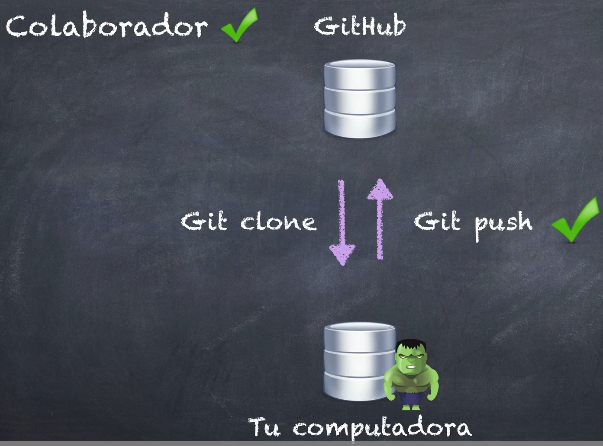 puedes clonar un repositorio de GitHub (con git glone) y también hacer un push
-   Si no eres un colaborador (y hay un repo publico en github): 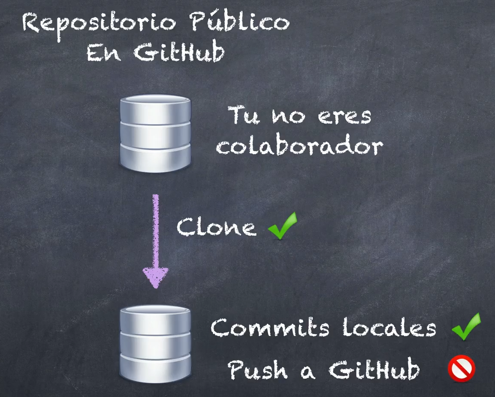 puedes clonar el repo y hacer commits locales... **pero** no puedes hacer push a GitHub

**¿Pero cómo podemos colaborar?**
Haciendo un fork -> 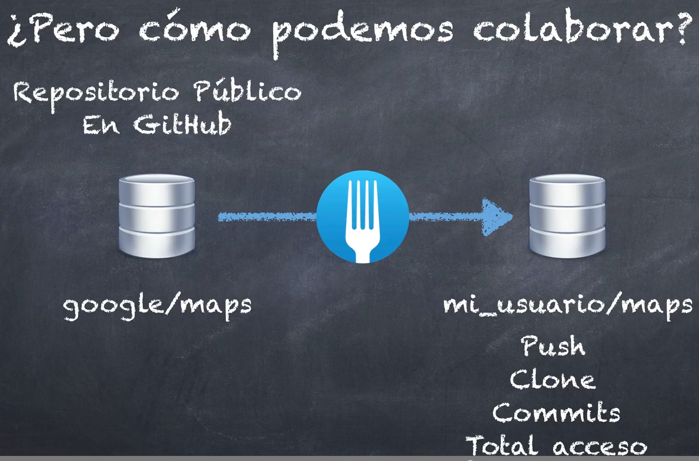 Clonar el repo original a un lugar (en nuestra cuenta de github) donde tenemos total acceso a ese repositorio... podemos hacer push, clone, commits y en general tener total acceso.

**¿Pero como podemos enseñarles mis modificaciones a los dueños originales?**
Dado que un fork es como una especie de rama adicional (separada de la original/padre) en la que tu estas trabajando a parte y que puede ser unida a la original... ahí es donde entra el **Pull Request** (enviar cambios a los dueños, para que lo acepten o rechacen y formen parte del proyecto original)

## Cloning y Fork

**Haciendo un fork y clone**

-   Para hacer un fork de un repo solo dale click al boton Fork... (ahi también puedes ver los forks existentes que hiciste)

-   Para traerlo (clonarlo) a tu local, solo ve al repo forkeado (clonado pues): dale click a "<> Code" y copia el link...y **en la carpeta raiz de tu proyecto** haz `git clone https://github.com/Klerith/legion-del-mal`: esto **creará una nueva carpeta** en donde se colocarán los archivos clonados... ya puedes cambiarle de nombre a la que gustes
    -   Al hacer git clone también automaticamente se define el origen por defecto hacia esa ruta... por ello normal puedes usar los comandos reducidos de `git push` y los demás
    -   Luego de eso puedes hacer cambios, hacer un commit, y finalmente hacer un **push** para que se manden tus cambios al repo forkeado (clonado pues)

## Pull Request

En tu repo clonado tienes varias opcioes interesantes en relacion al original:

-   Sync fork: hace un fetch del repo original y trae los nuevos cambios
-   **Contribute**: desde aqui puedes darle a **open pull request**, donde puedes configurarlo a tu gusto (mientras este en proceso o abierto, también puedes hacer un push local...), luego puedes darle a **create pull request**... donde también puedes configurarlo a tu gusto

> junto a estas opciones también te informa sobre en donde esta parado tu rama en relacion al original: puede ser que este 3 commits por delante... o por detras en donde primero deberas hacer un fetch

## Pull Request 2

si te piden que reviertas algunos cambios en un archivo en especifico que modificaste 2 commits anteriores entonces: `git checkout QWERD123 miembros.md`... esto revierte los cambios de dicho archivo... ya luego de esto puedes realizar un commit

**si eres dueño de un repo y alguien solicita un pullrequest**: puedes unirlo a tu rama, crear un squash o comentar sus cambios o pedirle que modifique algo antes de aceptar su pr

## Actualizando nuestro Fork - Teoría

si tienes un compañero nuevo en el que no confias, puedes usar los fork

**como podemos actualizar nuestro fork (siendo nosotros batman), con los cambios actualizados de superman?** 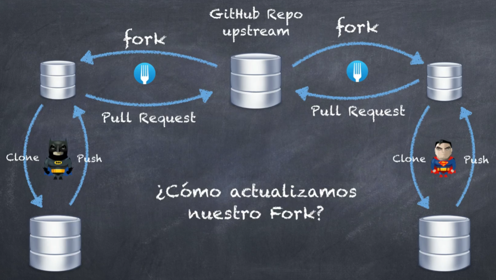

**tendriamos que agregar un nuevo remoto**... y luego tenemos que hacer un fetch o pull para actualizar nuestro repo local... y luego poder hacer un push y un pr 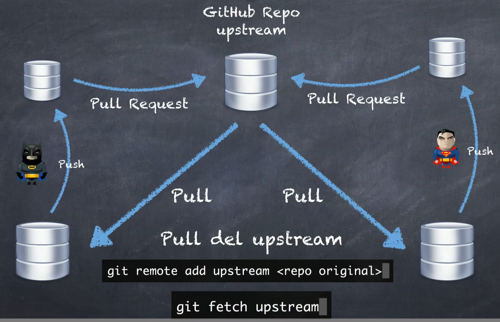

## Actualizando nuestro Fork - Teoría

cuando se trata de un repositorio del cual solo voy a trare informacion, se le llama upstream.
puedo añadir tantos repositorios como sea posible
añadiendo un repositorio remoto upstream (de un amigo junior que hizo un fork también) desde el que traere informacion:

-   `git remote add upstream https://githubcom/...`: aqui por ejemplo añades como remoto el repo en el que esta trabajando un amigo (en el que el mismo hizo un fork)... **recuerda que solo tienes acceso de lectura**

ahora:

-   `git pull upstream master`: me traerá la info del repo upstream... y de la rama master... recuerda resolver los conflictos si los hubiese y crea tu commit, luego ya sube los cambios con push
<!-- -   `git pull` funciona de forma normal con la url original -->

## Introducción a los flujos de trabajo

eso de hacer forks para juniors (aislados del original) esta bien pero es lento y engorroso: 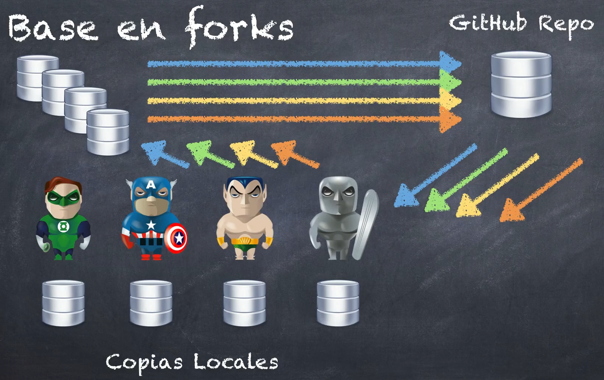

en las empresas es mas comun que se trabaje con un unico repositorio 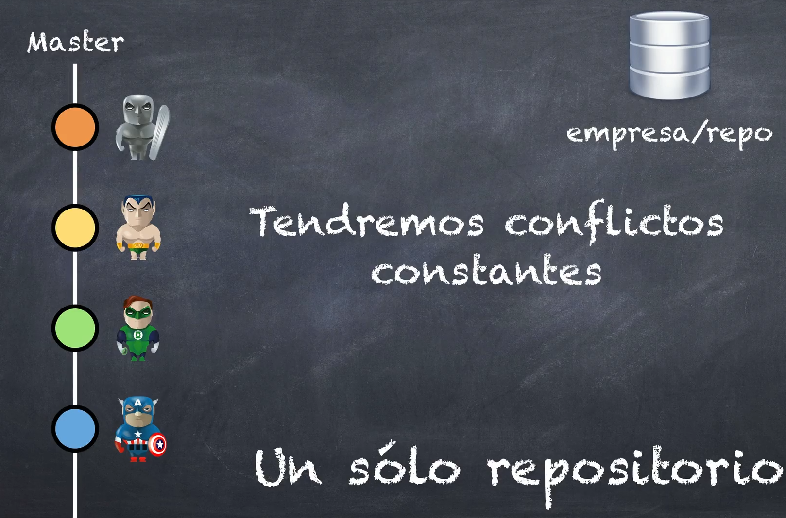, hay formas de trabajar de esta manera:

generalmente la organizacion de trabajo es asi: 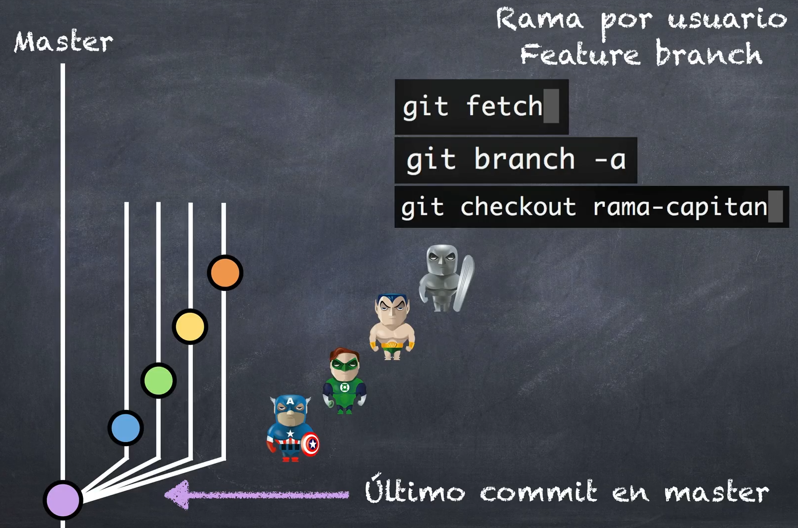

1. cualquier compañero puede unir mi rama secundaria a la principal 
2. otra forma es subiendo los cambios a mi rama en github y creando un pull request 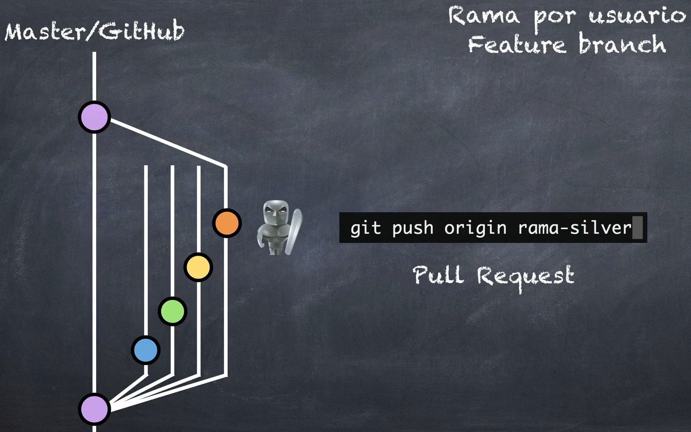

## Tarea - Preparemos un nuevo repositorio para reforzar lo aprendido

https://github.com/klerith/avengers

## Feature Branch - Flujo de trabajo mediante pull request

Feature branch basicamente es una nueva rama (separada de la principal) en la que trabajamos una nueva caracteristica.
Si tienes una nueva rama...
**¿Cómo haces para subir esa rama?**

<!-- si haces un push fallará pero te dirá que comando debes usar para solucionarlo.
Ese error basicamente dice "la rama-villanos no tiene un upstream branch"... es decir, que la rama no tiene un upstream (o rama remota) asociada. En Git, una rama "upstream" se refiere a la rama en el repositorio remoto que está vinculada o asociada con la rama local en la que se está trabajando. -->

-   `git push --set-upstream origin rama-villanos`: si no lo recuerdas solo haz un git push y mostrara este codigo. **despues introducir esto, ya se habrá hecho automaticamente el git push** (hará la subida de esa rama, ya no de la principal)... **ahora también puedes usar el `git push` con normalidad (tanto en esta rama-villanos, como en la rama principal)**
<!-- ese comando se utiliza para subir la rama local llamada "rama-villanos" al repositorio remoto "origin" y al mismo tiempo configurar dicha rama local para que haga seguimiento de su correspondiente rama remota en "origin" (esto solo si se utiliza por 1era vez con una rama local) -->
-   en github te mostrará el botón de "**compare & pull request**": esto es para unir los cambios de mi rama-villanos a mi rama principal, y además crear un pull request... **hazlo**

-   luego, si te mueves a la rama principal local y haces un `git pull`... te traerá los cambios unidos gracias al pull request
<!-- ya puedes borrar tu rama local con `git branch -d rama-villanos`... también puedes borrar la rama de github en github
opcional adicional: para eliminar la remota de tu git local (tanto del local como remoto) ve el archivo 07 remote.md de la carpeta dudas-->

## Feature Branch - Revisando el trabajo de otros compañeros

Desde github también puedes crear ramas.
Para "traerte" la rama por ejemplo de tu compañero de trabajo... haces `git pull --all`

<!-- podrías hacer `git pull` para también traerte la rama CREO... pero a veces no te las trae... -->

-   si revisas "git branch" y no ves la rama de dicha persona... podrás ver todas las ramas (**incluida los remotos**) con `git branch -a`... ahi si aparece esa rama remota de tu compañero

entonces... **como hago para pasarme a esa rama?**

-   solo cambias de rama con `git checkout rama-misiones`: eso pasara de solo remoto a local me parece
-   ahora en esta rama puedes normalmente hacer cambios, commit y push... y luego de eso crear un pull request

... si borras tu rama en github, en tu local aun aparecerá esa rama... y las demas remotas... aún hay basura...

## Limpiar ramas que ya no son necesarias

<!-- recuerda que loi ideal siempre es hacer un pull request en vez de hacer un merge -->

**¿Cómo limpio las ramas que ya no son necesarias?**

-   eliminando las locales: `git branch -d rama-misiones`
-   eliminando las remotas (en local y remoto [github]): `git push origin :rama-misiones`
    -   algunas veces dara error, en este caso por ejemplo porque ya la borraste de github (es decir, el remoto o la referencia a este ya no existe)... entonces hariamos lo siguiente
    -   `git remote prune origin`: elimina ls referencias (locales) a ramas remotas que ya no existen en el repositorio remoto. Este comando es especialmente útil para mantener tu repositorio local sincronizado y limpio de referencias obsoletas. <!-- revisa las ramas que ya no existe y actualiza las remotas... las limpia de mi local por ejemplo si no existen -->

<!-- ! si una rama ya no existe o ya no tiene razon de ser... borrala -->
<!-- a veces si quieres mantener ramas, por ejemplo en releases -->

## Rama de producción - GitHub

una rama de produccion podria ser por ejemplo una version anterior de la aplicacion que se quiere mantener aún... 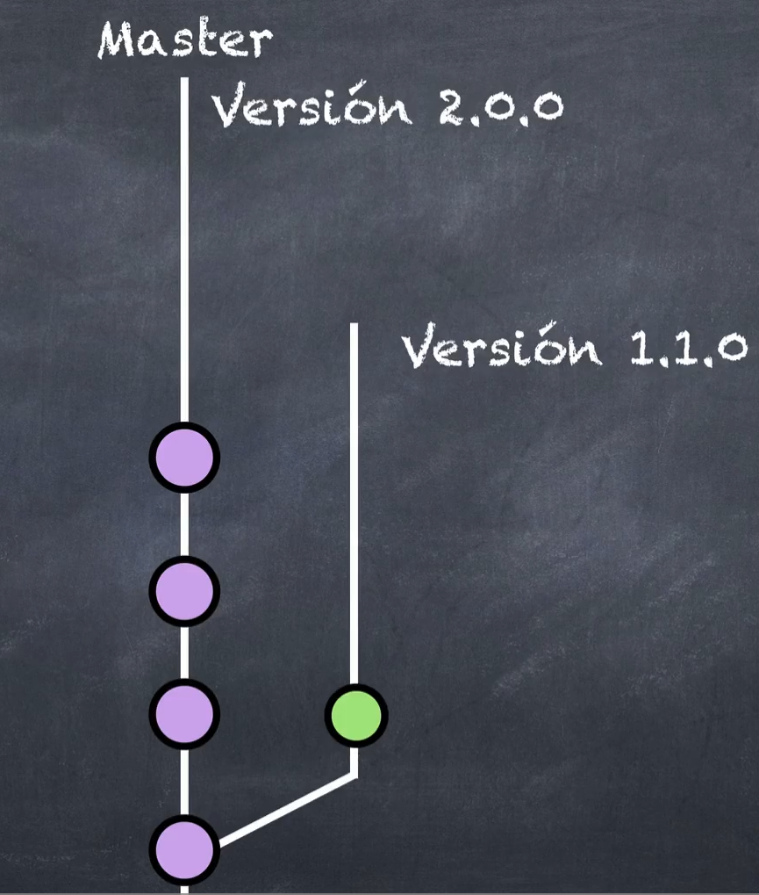
cuando vemos eso? 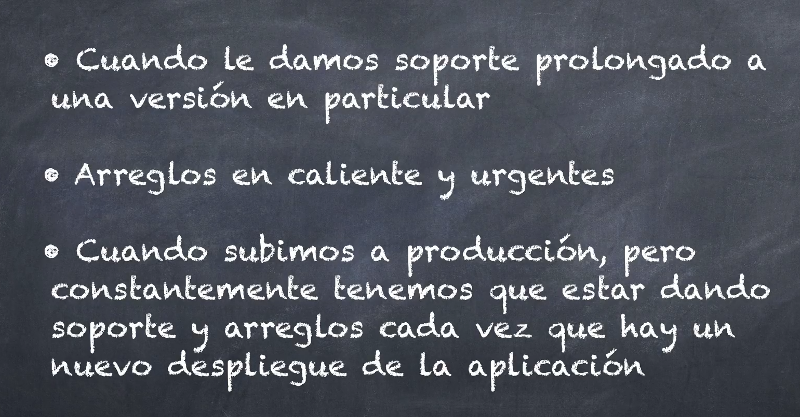

si tienes otra rama... **y alguien la borró de github**... pero hiciste antes un tag a una version de esa rama entonces podrás verla aún.

pero que pasa si alguien la borro de github, tu la borraste de manera local, encima podaste o eliminaste la referencia... como la recupero?... mira la siguiente seccion

## Recuperar una rama de producción

**¿como recuperamos la rama que borramos del repositorio local y remoto?**
lo haces (creo) siempre y cuando tengas tags (o releases) creados en dicha rama borrada

-   local:

    -   miras los tags, te mueves hacia el tag (git checkout v1.0.0) que creaste (veras que en "git s" dice "no branch")...
    -   creas y te mueves hacia la rama: `git checkout -b rama-kitkat`
    -   pusheas los cambios al remoto `git push --set-upstream origin rama-kitkat`

-   remoto:
    -   te vas al tag (al commit de dicho tag)
    -   en la pestaña de rama, escribes un nombre y le das a crear rama

**¿y si borras absolutamente todo, incluyendo el tag?**

-   usas el reflog y buscas el momento en el que quieres reconstruir la rama
